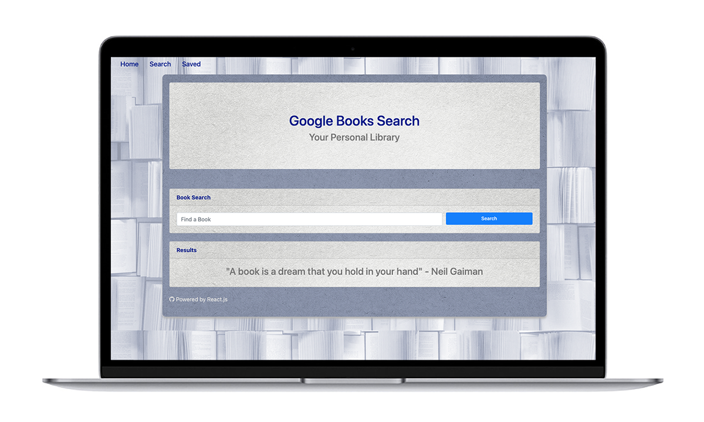
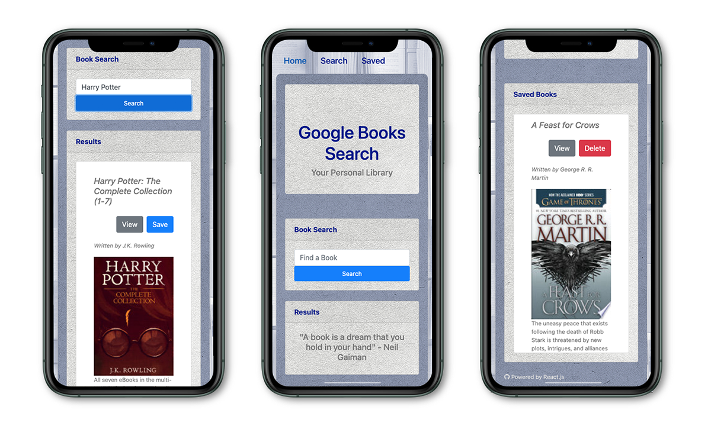
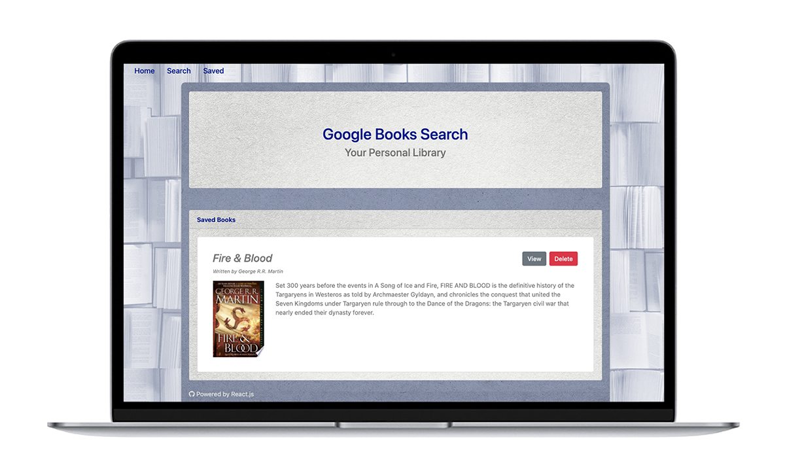

# Jpx Google Books Search

## Table of Contents

- [Project description](#project-description)
- [User story](#user-story)
- [Installation](#installation)
- [Features](#features)
- [Application preview](#application-preview)
- [Technology](#technology-and-framework)
- [Contributing](#contributing)
- [Questions](#questions)
- [License](#license)

## Project Description

The [**Google Books Search**](https://jpx-google-books-search.herokuapp.com/) app allows users to search for their books of interest via the Google Books API and have the searched books' covers and important information displayed on a seamless designed interface. Users are able to save books in a visual collection to purchase them later on **Google Books**.

## User Story

---

- As an avid reader, I want to be able to search for interesting books online, have a quick access to their relevant information, and keep them neatly organized
- So that I can consult the book collection anytime and purchase books anytime.

---

## Installation

The **Google Books Search** app is deployed in Heroku, no special installation is required other than a web browser for mobile or desktop devices. ([**Google Chrome**](https://www.google.com/chrome/?brand=CHBD&gclid=Cj0KCQjwv7L6BRDxARIsAGj-34pI6kcGFGrZkxQgztLSwZZ7JzwQJFBfDBdgTHCurYEpg3QscMjHhYUaAkkjEALw_wcB&gclsrc=aw.ds) is recommended).

## Features

**Google Books Search:**

- Gives the user the option to search for any book by name.
- Displays detailed information for every book: Title, Authors, Cover, and Description.
- Gives the user the option to save books to the books collection
- Users can view a book and purchase it online from the Google Books service
- Users can remove any previously saved book from the collection
- Responsive interface across devices

## Application Preview

## Technology and Framework

**MERN application:**

- MongoDB / Mongoose
- Express.js
- React.js
- Node.js
- Bootstrap UI
- Heroku
- Google Books API

**Npm Dependencies:**

- Axios
- If-env
- Bootstrap
- Express
- React Router Dom

## Contributing

[Application repository](https://github.com/JonPhoenix/jpx-google-books-search)

## Questions

- For further questions, please contact the author at: jonphx@uw.edu

## License

    MIT

---
